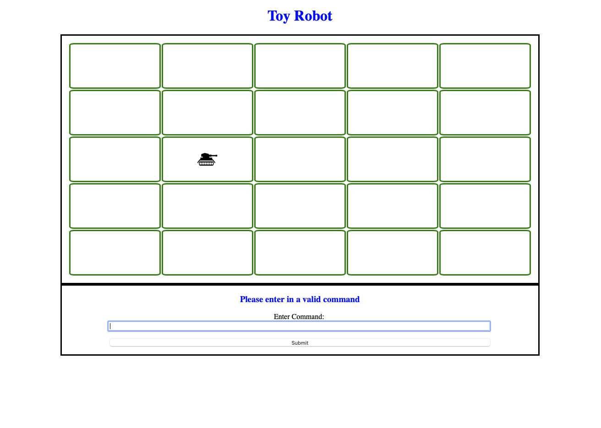

## Table of contents

-   [General info](#general-info)
-   [Download](#download)
-   [Assumptions](#assumptions)
-   [Test Data](#test-data)
-   [Necessary Deliverables](#necessary-deliverables)
-   [Screenshots](#screenshots)
-   [In-depth Features of ToyRobot](#in-depth-features-of-ToyRobot)
-   [Challenges](#challenges)
-   [Technologies Used](#technologies-used)
-   [Approach Taken](#approach-taken)

## General info

This Toy Robot application is used to complete a Coding Challenge.

Instructions to download this purely JS solution futher below.

NOTL For a Docker "containerised" version, you can found it here:

-   https://github.com/mistergjones/toyrobotjs

## Download

Download via Github:

-   https://github.com/mistergjones/toyrobotpureJS

## Necessary Deliverables

This project is to demonstrate and conform to the coding challenge requirements found below:

-   The application is a simulation of a toy robot moving on a square tabletop
-   The table top should have dimensions of 5 units x 5 units
-   There are no obstructions on the table surface
-   The robot is free to roam around the surface of the table, but must be prevented from falling to destruction
-   Any movement that would result in the robot falling from the table must be prevented, however further valid movement commands must still be allowed

Create an application that can read in commands of the following form:

```
PLACE X,Y,FACING
MOVE
LEFT
RIGHT
REPORT
```

**PLACE** will put the toy robot on the table in position X, Y and facing NORTH, SOUTH, EAST or WEST.

-   The origin (0,0) can be considered to be the SOUTH WEST most corner
-   The first valid command to the robot is a PLACE command, after that, any sequence of commands may be issued, in any order, including another PLACE command
-   The application should discard all commands in the sequence until a valid PLACE command has been executed

**MOVE** will move the toy robot one unit forward in the direction it is currently facing.

**LEFT** and **RIGHT** will rotate the robot 90 degrees in the specified direction without changing the position of the robot. Ie. the facing should change but the position should not.

**REPORT** will announce the X, Y and FACING of the robot. This can be in any form, but standard output is sufficient.

-   A robot that is not on the table can choose to ignore the MOVE, LEFT, RIGHT and REPORT commands
-   Input can be from a file, or from standard input, as the developer chooses
-   Provide test data to exercise the application

## Constraints:

The toy robot must not fall off the table during movement. This also includes the initial placement of the toy robot.
Any move that would cause the robot to be outside of the bounds of the table should be prevented or ignored.

### Example Input and Output:

#### A

```
PLACE 0, 0, NORTH
MOVE
REPORT
```

Output: 0, 1, NORTH

#### B

```
PLACE 0, 0, NORTH
LEFT
REPORT
```

Output: 0, 0, WEST

```
PLACE 1, 2, EAST
MOVE
MOVE
LEFT
MOVE
REPORT
```

Output: 3, 3, NORTH

## Assumptions

-   A simulated square table top meant utilising a GUI.
-   As per Example Input and Output below in the challenge, valid PLACE command is: "PLACE 0, 0, NORTH" and not "PLACE 0,0,NORTH" or any other variation.
-   Assumed that if an invalid command is given, no other valid command will work until a new valid PLACE command.

## TEST DATA

```
PLACE -1, -1, SOUTH
```

Result: Ignored and Robot is not placed

```
PLACE 3, 3, WEST
REPORT
```

Result: Standard Alert Dialogue appears showing Grid Position: 3,3,

```
MOVE
MOVE
MOVE
MOVE
REPORT
```

Result: The last move is ignored as robot would fall. REPORT shows current grid position: 0,3, WEST

```
RIGHT
```

Result: Toy Robot faces North

```
MOVE
MOVE
```

Result: Toy Robot only moves 1 grid. Ignores second as it would fall off table.

```
MV
RIGHT
```

Result: Application ignore MV and RIGHT. Becuse MV is a wrong command, it will ignore all other commands until a valid PLACE commmand is provided.

```
PLACE 1, 1, NORTH
REPORT
```

Result: REPORT shows current grid position: 1,1,NORTH

## Screenshots



## Approach Taken

-   Reviewed the requirements.
-   Took the approach of a TDD mindset.
-   Drew a basic ER Diagram to represent the entities involved.
-   Then wrote down a basic algorithm with defined or what I perceived to be the correct function calls.

## Challenges

-   Working out how to remove the previous image of a tank when it rotate or moves.

## Learnings

-   The key challenge above was resolved by teh Solved by the removeChild() function.

## Technologies Used

Project is created with:

-   Javascript
-   CSS
-   HTML
-   DOM manipulation
